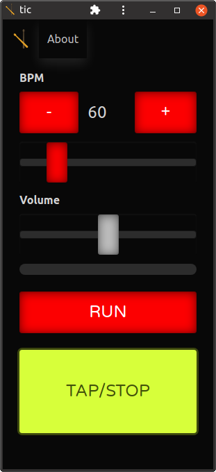

# metronome-pwa

A simple metronome, as progressive web app. Available at https://tic.replayer.ch

# Installation

You can use it right from the [website](https://tic.replayer.ch), without any installation, or you can install it as a [Progressive web application](https://en.wikipedia.org/wiki/Progressive_web_application), for offline use within your browser. 

 - [Google Chrome](https://support.google.com/chrome/answer/9658361)

# Notes

## Wake Lock API availablilty

Currently, the [Screen Wake Lock API is not available on all browsers](https://caniuse.com/wake-lock). There is an an [abandoned, Non-standard, similar Wake Lock API by Mozilla](https://developer.mozilla.org/en-US/docs/Archive/B2G_OS/API/Wake_Lock_API), and the superseding [Screen Wake Lock API](https://developer.mozilla.org/en-US/docs/Web/API/Screen_Wake_Lock_API).

In the hope to prevent screen locks, and while a better solution is available, the projects uses the [NoSleep.js "Hack" by Rich Tibbett](https://github.com/richtr/NoSleep.js).

## How to use Bulma in a Vue3 project (not using Buefy)

For a Vue3 project created with the Vue CLI (With the CSS Pre-processors not selected), mainly follow the guide at https://bulma.io/documentation/customize/with-node-sass/ with a few changes:

-   Omit the first step, since we are using the already available project structure with it's package.json
-   As indicated install the packages for development, as we are only customizing bulma during development time

    npm install node-sass --save-dev
    npm install bulma --save-dev

This will add the packages to the `devDependencies` in `package.json`

Then follow the steps from Number 3: https://bulma.io/documentation/customize/with-node-sass/#3-create-a-sass-file with the following adaptions

-   Use an appropriate style name
-   Put the css in `public/css`

To run both the SASS autocompilation and npm's serve script, use two terminals. You can do that also from within VSCode.

## Aligning the Buttons with controls

https://css-tricks.com/snippets/css/a-guide-to-flexbox/

## Resources

-   [Getting Started with Web Audio API](https://www.html5rocks.com/en/tutorials/webaudio/intro/) is a very good intro into the Audio API
